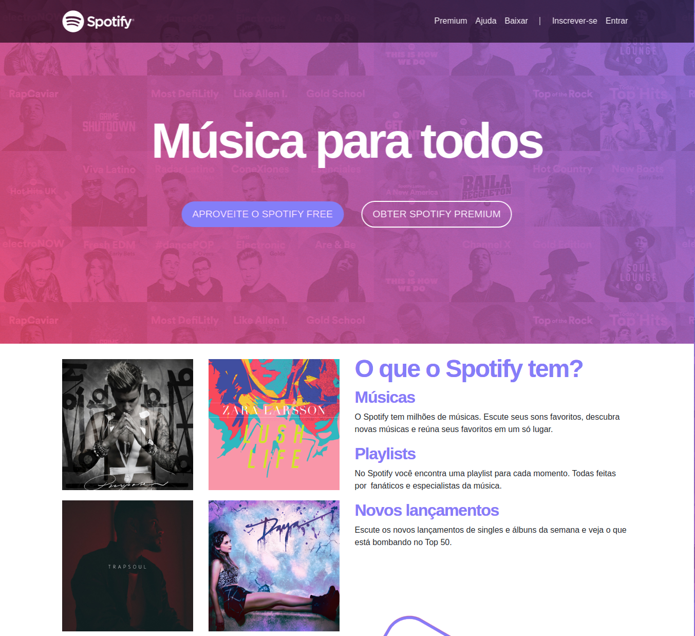

# Spotify-Clone

  

## :bookmark: About

<strong>Spotify-Colne</strong> is a clone of the old home of the Spotify website.

## :rocket: Technologies Used

The project was developed using the following technologies

- [HTML 5](https://www.devmedia.com.br/o-que-e-o-html5/25820)
- [CSS 3](https://developer.mozilla.org/pt-BR/docs/Web/CSS)
- [JavaScript](https://developer.mozilla.org/pt-BR/docs/Web/JavaScript)
- [Bootstrap 4](https://getbootstrap.com/docs/4.0/getting-started/introduction/)

<h4 align="center">
    Made with 💜 by <a href="https://www.linkedin.com/in/leonardo-f-carvalho/" target="_blank">Leonardo Carvalho</a>
</h4>

